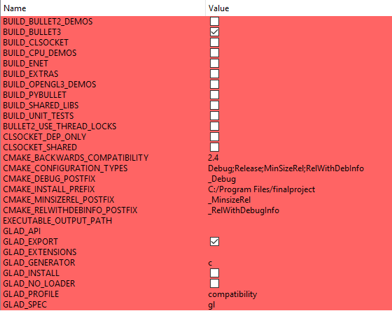
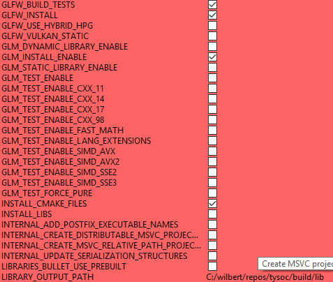
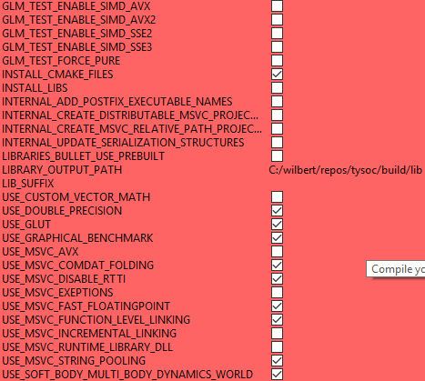

# computer_graphics_finalproject
Final project of the computer graphics course @ ucsp

## Cloning the project

The project depends on some libraries, which are added as submodules. Make sure you clone the project with the --recursive option, in order to get the dependencies from other repositories.

	git clone --recursive https://github.com/wpumacay/computer_graphics_finalproject.git

## Build steps

I've test it with both Windows 10 and Ubuntu 16.04. The cmake file should work for other systems as well. In case it doesn't, just send me a message to wilsanph@gmail.com .

Also, make sure you are using an out of place build, by making a build directory and compiling the code there.

	mkdir build
	cd build
	cmake-gui or cmake OPTIONS ..

### Windows

I've test it with visual studio 2017 ( vc150 ). Just run cmake-gui to generate the solution files.

Make sure you uncheck the USE_MSVC_RUNTIME_DLL flag ( to build the dependencies as static libraries ) and check the USE_DOUBLE_PRECISION flag, to compile bullet with double precision support. Make sure you set the right toolchain ( e.g. vc150 x64 if using visual studio 2017 ). After generating the project solution, just open it 

In the windows case, there is no external dependency to be installed. All the required packages are submodules of the project, and are included if you cloned the project with the --recursive option.

**Compilation flags**

Below, you can find the flags that should be set in order to successfully compile the project using cmake-gui and visual studio.

### Linux

I've tested the project in Ubuntu 16.04, using g++ and makefiles. I've been having trouble making bullet a submodule and compiling it alongside the project, so the best way is to install bullet separately. The default configuration tries to search if Bullet was installed. If not, it falls back to the submodule. Unfortunately, I still can't find the issue with the build when using as a submodule, but will in a future release.

To build, just run ** cmake .. ** from the build directory.

### Running the demos

The current demo I have is the testScenario demo. Depending on your platform, just set it as a startup project ( visual studio ), or just run the generated binary in the build directory ( linux )

